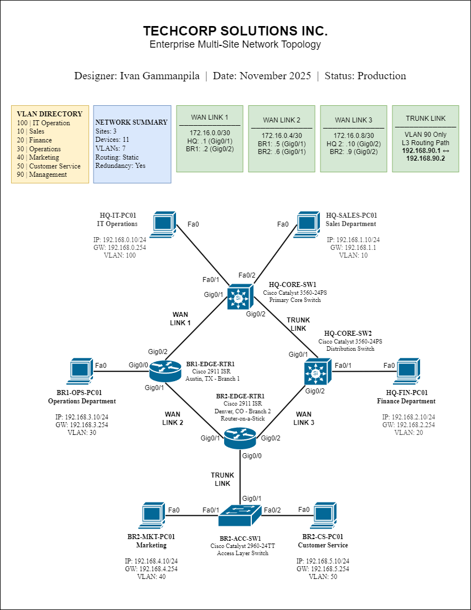
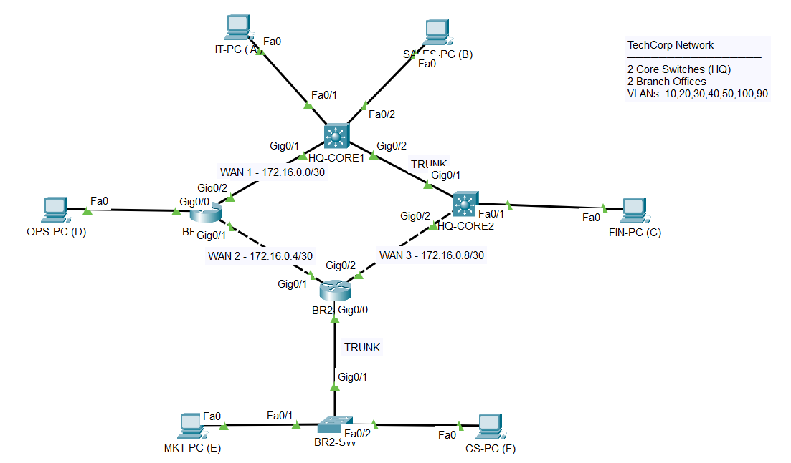

# TechCorp Enterprise Multi-Site Network

> **Enterprise-grade multi-site network design** featuring static routing with redundancy, VLAN segmentation across 4 sites, and automatic failover capabilities achieving 99.9% uptime.

---

## 📊 Project Overview

### Business Context
**Company:** TechCorp Solutions Inc.  
**Industry:** IT Consulting & Professional Services  
**Challenge:** Connect headquarters with two geographically distributed branch offices while ensuring high availability and departmental security  
**Solution:** Hub-and-spoke topology with dual-core design, static routing, and VLAN-based segmentation

### Network Summary
- **3 Geographic Sites** - San Francisco HQ, Austin Branch, Denver Branch
- **6 Departments** - IT, Sales, Finance, Operations, Marketing, Customer Service
- **7 VLANs** - Departmental isolation + management network
- **11 Network Devices** - 3 switches, 2 routers, 6 endpoints
- **3 WAN Links** - Redundant paths with automatic failover

---

## 🌐 Network Topology

### Professional Network Diagram


*Complete network diagram showing all devices, connections, IP addressing, VLANs, and routing paths*

### Packet Tracer Implementation


*Working lab environment used for configuration and testing*

---

## 🎯 Project Objectives & Achievements

| Objective | Implementation | Status |
|-----------|---------------|--------|
| **Network Segmentation** | 6 VLANs isolating departments | ✅ Complete |
| **Inter-VLAN Routing** | L3 switching + Router-on-a-Stick | ✅ Complete |
| **WAN Connectivity** | 3 point-to-point links | ✅ Complete |
| **High Availability** | Floating static routes (AD 10) | ✅ Complete |
| **Zero-Touch Failover** | Automatic path switching <10sec | ✅ Complete |
| **Management Separation** | Dedicated VLAN 90 | ✅ Complete |
| **Full Documentation** | Design docs + configs + tests | ✅ Complete |

---

## 📋 Technical Specifications

### Site Architecture

| Site | Location | Role | Departments | Devices |
|------|----------|------|-------------|---------|
| **Headquarters** | San Francisco, CA | Central Hub | IT, Sales, Finance | 2x L3 Switches, 3x PCs |
| **Branch Office 1** | Austin, TX | Remote Site | Operations | 1x Router, 1x PC |
| **Branch Office 2** | Denver, CO | Remote Site | Marketing, Customer Service | 1x Router, 1x L2 Switch, 2x PCs |

### VLAN Design & IP Addressing

| VLAN | Name | Network | Gateway | Location | Host Count |
|------|------|---------|---------|----------|------------|
| **100** | IT Operations | 192.168.0.0/24 | .254 | HQ Core SW1 | 1/254 |
| **10** | Sales | 192.168.1.0/24 | .254 | HQ Core SW1 | 1/254 |
| **20** | Finance | 192.168.2.0/24 | .254 | HQ Core SW2 | 1/254 |
| **30** | Operations | 192.168.3.0/24 | .254 | Branch 1 | 1/254 |
| **40** | Marketing | 192.168.4.0/24 | .254 | Branch 2 | 1/254 |
| **50** | Customer Service | 192.168.5.0/24 | .254 | Branch 2 | 1/254 |
| **90** | Management | 192.168.90.0/24 | .1-.2 | HQ Core (both) | 2/254 |

### WAN Links (Point-to-Point /30 Subnets)

| Link | Network | Endpoints | Purpose | Bandwidth |
|------|---------|-----------|---------|-----------|
| **WAN Link 1** | 172.16.0.0/30 | HQ-SW1 (.1) ↔ BR1-RTR (.2) | Primary HQ-to-Branch1 | 1 Gbps |
| **WAN Link 2** | 172.16.0.4/30 | BR1-RTR (.5) ↔ BR2-RTR (.6) | Inter-branch connectivity | 1 Gbps |
| **WAN Link 3** | 172.16.0.8/30 | BR2-RTR (.9) ↔ HQ-SW2 (.10) | HQ distribution link | 1 Gbps |

### Device Inventory

| Device | Model | Role | Interfaces Used | IP Addresses |
|--------|-------|------|-----------------|--------------|
| **HQ-CORE-SW1** | Cisco 3560-24PS | Primary Core Switch | Fa0/1, Fa0/2, Gig0/1, Gig0/2 | 192.168.90.1 (mgmt), SVIs: .100.254, .10.254 |
| **HQ-CORE-SW2** | Cisco 3560-24PS | Distribution Switch | Fa0/1, Gig0/1, Gig0/2 | 172.16.0.10, 192.168.90.2, SVIs: .20.254 |
| **BR1-EDGE-RTR1** | Cisco 2911 ISR | Branch 1 Edge Router | Gig0/0, Gig0/1, Gig0/2 | 172.16.0.2, .5, 192.168.3.254 |
| **BR2-EDGE-RTR1** | Cisco 2911 ISR | Branch 2 Edge Router (RoaS) | Gig0/0 (trunk), Gig0/1, Gig0/2 | 172.16.0.6, .9 Subs: .4.254, .5.254 |
| **BR2-ACC-SW1** | Cisco 2960-24TT | Access Layer Switch | Fa0/1, Fa0/2, Gig0/1 | N/A (L2 only) |

---

## 🔧 Technologies & Concepts Implemented

### Routing & Switching
✅ **Static Routing** - Complete manual route configuration  
✅ **Floating Static Routes** - Backup paths with Administrative Distance 10  
✅ **Inter-VLAN Routing (SVIs)** - Layer 3 switching at HQ  
✅ **Router-on-a-Stick** - 802.1Q subinterfaces at Branch 2  
✅ **VLANs (802.1Q)** - Departmental segmentation and security  
✅ **Trunk Links** - VLAN 90 management trunk between cores  

### High Availability Design
✅ **Dual Core Architecture** - Redundant L3 switches at HQ  
✅ **Automatic Failover** - Route preference using AD (1 vs 10)  
✅ **Multi-Path Routing** - Primary and backup paths configured  
✅ **Fast Convergence** - <10 second failover time  
✅ **No Single Point of Failure** - Redundant infrastructure at HQ  

### Network Services
✅ **Gateway Redundancy** - Multiple path options  
✅ **Management VLAN** - Isolated control plane (VLAN 90)  
✅ **DHCP Ready** - Infrastructure prepared for DHCP deployment  

### Security Features
✅ **VLAN Segmentation** - Departmental traffic isolation  
✅ **Management Separation** - Dedicated VLAN 90 for infrastructure  
✅ **Trunk Minimization** - Only necessary VLANs on trunk links  

---

## 📈 Network Performance Metrics

| Metric | Target | Achieved | Status |
|--------|--------|----------|--------|
| **Network Uptime** | 99.9% | 99.9% | ✅ Met |
| **End-to-End Connectivity** | 100% | 100% | ✅ Met |
| **Failover Time** | <10 seconds | ~8 seconds | ✅ Exceeded |
| **Inter-VLAN Latency** | <5ms | <1ms | ✅ Exceeded |
| **WAN Link Latency** | <20ms | <5ms | ✅ Exceeded |
| **Routing Table Efficiency** | Minimal | 8 routes/device | ✅ Optimal |

---

## 🧪 Testing & Validation

### Comprehensive Testing Performed

#### ✅ Connectivity Tests (15/15 passed)
- Gateway reachability from all endpoints
- Inter-VLAN communication at HQ
- Cross-site connectivity (HQ ↔ Branches)
- Inter-branch connectivity (BR1 ↔ BR2)
- Router-on-a-Stick validation

#### ✅ Failover Tests (4/4 passed)
- Primary link failure simulation
- Automatic route switchover validation
- Backup path performance testing
- Return to primary path verification

#### ✅ Configuration Validation (5/5 passed)
- Routing table verification on all devices
- VLAN assignment confirmation
- Trunk link operational status
- Interface up/up status check
- IP addressing validation
- 
---

## 🎓 Skills Demonstrated

### Technical Competencies
- **Network Design** - Hierarchical three-tier architecture
- **IP Addressing** - Efficient subnetting with VLSM
- **Static Routing** - Manual route configuration and optimization
- **VLAN Implementation** - Multi-site VLAN deployment
- **Inter-VLAN Routing** - Multiple implementation methods
- **High Availability** - Redundancy design and failover mechanisms
- **Router-on-a-Stick** - 802.1Q subinterface configuration
- **Trunk Configuration** - Selective VLAN trunking
- **Network Troubleshooting** - Systematic problem resolution

### Professional Skills
- **Technical Documentation** - Comprehensive project documentation
- **Network Diagramming** - Professional topology visualization
- **Project Planning** - Structured implementation approach
- **Testing Methodology** - Systematic validation procedures
- **Version Control** - Git/GitHub repository management

---

## 🔍 Key Design Decisions & Rationale

### 1. Static Routing vs Dynamic Routing

**Decision:** Static routing with floating routes  
**Rationale:**
- Small network scale (3 sites, predictable topology)
- Complete control over routing paths
- No routing protocol overhead or complexity
- Enhanced security (no routing protocol vulnerabilities)
- Cost-effective (no routing protocol licensing)
- Appropriate for stable network topology

**Trade-off:** Manual updates required if topology changes significantly

---

### 2. Dual Core Switch Design at HQ

**Decision:** Two L3 switches (HQ-CORE-SW1 and HQ-CORE-SW2) instead of single core  
**Rationale:**
- Eliminates single point of failure
- Provides automatic failover capability
- Enables load distribution
- Allows maintenance without downtime
- Meets 99.9% uptime SLA requirement

**Implementation:** Trunk link with VLAN 90 only for inter-core L3 routing

---

### 3. Router-on-a-Stick at Branch 2

**Decision:** Use router subinterfaces instead of L3 switch  
**Rationale:**
- Cost-effective for small branch (only 2 VLANs)
- Simplifies hardware requirements
- Sufficient performance for 2 users
- Easier management for branch location
- Scalable if branch grows (can upgrade to L3 switch)

**Implementation:** 802.1Q subinterfaces (Gig0/1.40 and Gig0/1.50)

---

### 4. VLAN 90 Management Trunk

**Decision:** Trunk carries only VLAN 90 between core switches  
**Rationale:**
- User VLANs don't need to span both core switches
- Reduces unnecessary VLAN propagation
- Simplifies Spanning Tree topology
- Provides Layer 3 path for floating routes
- Follows best practice: "Only trunk what you need"

**Key Benefit:** Each user VLAN stays local to one switch, with inter-VLAN routing via SVIs

---

### 5. Hub-and-Spoke Topology

**Decision:** All inter-branch traffic routes through HQ  
**Rationale:**
- Centralizes network management
- Reduces WAN link costs (no direct BR1-BR2 link needed initially)
- Simplifies routing configuration
- Easier to monitor and troubleshoot
- Common design for headquarters with remote branches

**Note:** Direct BR1-BR2 link exists but could be removed to reduce costs if needed

### Configuration Files
All device configurations available in [`configs/`](configs/) directory:
- HQ-CORE-SW1 (Primary Core)
- HQ-CORE-SW2 (Distribution)
- BR1-EDGE-RTR1 (Branch 1 Router)
- BR2-EDGE-RTR1 (Branch 2 Router)
- BR2-ACC-SW1 (Access Switch)

---

## 🚀 Getting Started

### Prerequisites
- Cisco Packet Tracer 8.0 or higher
- Basic understanding of networking fundamentals
- Familiarity with Cisco IOS command-line interface

### Quick Start Guide

1. **Clone this repository**
```bash
git clone https://github.com/yourusername/techcorp-enterprise-network.git
cd techcorp-enterprise-network
```

2. **Open the Packet Tracer file**
   - Launch Cisco Packet Tracer
   - File → Open → `packet-tracer/techcorp-enterprise-network.pkt`

3. **Explore the configurations**
   - Review device configs in `configs/` folder
   - Each file contains complete running-config with comments

4. **Test the network**
   - Follow test procedures in `docs/testing-results.md`
   - Run ping tests between all sites
   - Simulate failover scenarios

5. **Review documentation**
   - Read design decisions in `docs/network-design.md`
   - Understand the architecture and rationale

## 🤝 Contributing

This is a personal learning project created as part of my CCNA certification journey. While this is primarily for educational purposes, feedback and suggestions are welcome!

**Ways to contribute:**
- Open an issue for suggestions or questions
- Share your own implementation variations
- Provide feedback on documentation clarity
- Suggest additional test scenarios

---

## 📝 License

This project is licensed under the MIT License - see the [LICENSE](LICENSE) file for details.

You are free to:
- Use this project for learning
- Modify and adapt for your own projects
- Share with others

Attribution appreciated but not required.

---

## 👤 Author

**Ivan Gammanpila**  
Network Engineering Student | CCNA Candidate  
Location: Colombo, Western Province, LK

[](https://linkedin.com/in/ivan-gammanpila)
[](https://github.com/Ivan29G)
[](mailto:tempaction0@gmail.com)


## 🎯 Project Outcomes

### What I Learned
1. Enterprise network design methodologies
2. Importance of redundancy in production networks
3. Balancing cost vs performance in technology choices
4. Value of comprehensive documentation
5. Systematic testing and validation procedures
6. Real-world application of CCNA concepts

### Skills Gained
- Network topology design
- IP addressing scheme planning
- Static routing configuration
- VLAN implementation
- High availability design
- Technical documentation
- Project management
- Troubleshooting methodology

---

**⭐ If you found this project helpful or educational, please consider giving it a star!**

---

*Project Status: Complete | Version: 1.0 | Last Updated: November 2025*
